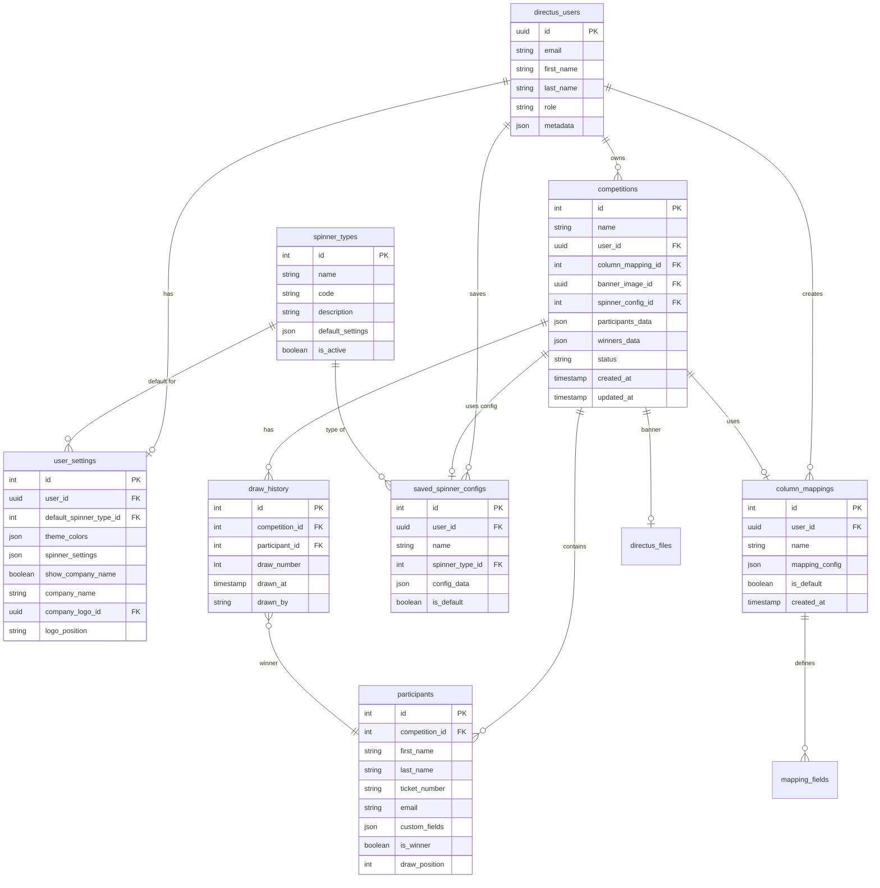

# Directus Database Schema Documentation

## Overview

This document provides a complete specification of the Directus database schema for the DrawDay Spinner application. It defines all collections, their fields, relationships, and business logic.

## Table of Contents

1. [Schema Overview](#schema-overview)
2. [Collection Relationships Diagram](#collection-relationships-diagram)
3. [Core Collections](#core-collections)
4. [Settings Collections](#settings-collections)
5. [Mapping Collections](#mapping-collections)
6. [Asset Collections](#asset-collections)
7. [Activity Collections](#activity-collections)
8. [Field Specifications](#field-specifications)
9. [Implementation Notes](#implementation-notes)

## Schema Overview

The DrawDay Spinner database is organized into several logical groups:

- **Core Data**: Users, Competitions, Participants
- **Configuration**: User Settings, Spinner Types, Column Mappings
- **Assets**: Uploaded images and banners
- **Activity**: Draw history, audit logs

## Collection Relationships Diagram



## Core Collections

### 1. competitions

**Purpose**: Stores all competition/raffle data

| Field             | Type        | Required | Description                 | Relations                  |
| ----------------- | ----------- | -------- | --------------------------- | -------------------------- |
| id                | integer     | Yes      | Auto-increment primary key  | -                          |
| name              | string(255) | Yes      | Competition name            | -                          |
| user_id           | uuid        | Yes      | Owner of the competition    | → directus_users.id        |
| column_mapping_id | integer     | No       | Associated column mapping   | → column_mappings.id       |
| banner_image_id   | uuid        | No       | Competition banner image    | → directus_files.id        |
| spinner_config_id | integer     | No       | Saved spinner configuration | → saved_spinner_configs.id |
| participants_data | json        | Yes      | JSON array of participants  | -                          |
| winners_data      | json        | No       | JSON array of winners       | -                          |
| status            | string(50)  | Yes      | active, completed, archived | -                          |
| draw_date         | datetime    | No       | Scheduled draw date         | -                          |
| description       | text        | No       | Competition description     | -                          |
| rules             | text        | No       | Competition rules           | -                          |
| prize_details     | json        | No       | Prize information           | -                          |
| max_entries       | integer     | No       | Maximum allowed entries     | -                          |
| created_at        | timestamp   | Yes      | Creation timestamp          | -                          |
| updated_at        | timestamp   | Yes      | Last update timestamp       | -                          |
| completed_at      | timestamp   | No       | Completion timestamp        | -                          |

**Indexes**:

- user_id (for user's competitions)
- status (for filtering)
- created_at (for sorting)

### 2. participants

**Purpose**: Individual participant records (alternative to JSON storage)

| Field          | Type        | Required | Description                      | Relations         |
| -------------- | ----------- | -------- | -------------------------------- | ----------------- |
| id             | integer     | Yes      | Auto-increment primary key       | -                 |
| competition_id | integer     | Yes      | Parent competition               | → competitions.id |
| first_name     | string(100) | Yes      | Participant's first name         | -                 |
| last_name      | string(100) | Yes      | Participant's last name          | -                 |
| ticket_number  | string(50)  | Yes      | Unique ticket/entry number       | -                 |
| email          | string(255) | No       | Participant email                | -                 |
| phone          | string(50)  | No       | Phone number                     | -                 |
| custom_fields  | json        | No       | Additional custom data           | -                 |
| is_winner      | boolean     | No       | Winner flag                      | -                 |
| draw_position  | integer     | No       | Position in draw (1st, 2nd, etc) | -                 |
| created_at     | timestamp   | Yes      | Entry timestamp                  | -                 |

**Indexes**:

- competition_id, ticket_number (unique constraint)
- competition_id, is_winner (for winner queries)

### 3. draw_history

**Purpose**: Audit trail of all draws conducted

| Field          | Type      | Required | Description                          | Relations           |
| -------------- | --------- | -------- | ------------------------------------ | ------------------- |
| id             | integer   | Yes      | Auto-increment primary key           | -                   |
| competition_id | integer   | Yes      | Competition drawn from               | → competitions.id   |
| participant_id | integer   | No       | Winner (if using participants table) | → participants.id   |
| winner_data    | json      | Yes      | Winner details snapshot              | -                   |
| draw_number    | integer   | Yes      | Sequential draw number               | -                   |
| drawn_at       | timestamp | Yes      | Draw timestamp                       | -                   |
| drawn_by       | uuid      | Yes      | User who conducted draw              | → directus_users.id |
| spinner_config | json      | No       | Spinner settings used                | -                   |
| notes          | text      | No       | Draw notes                           | -                   |

## Settings Collections

### 4. user_settings

**Purpose**: User-specific application settings

| Field                    | Type        | Required | Description                 | Relations           |
| ------------------------ | ----------- | -------- | --------------------------- | ------------------- |
| id                       | integer     | Yes      | Auto-increment primary key  | -                   |
| user_id                  | uuid        | Yes      | User reference              | → directus_users.id |
| default_spinner_type_id  | integer     | No       | Default spinner type        | → spinner_types.id  |
| theme_colors             | json        | No       | Custom theme colors         | -                   |
| spinner_settings         | json        | No       | Default spinner settings    | -                   |
| show_company_name        | boolean     | Yes      | Display company name flag   | -                   |
| company_name             | string(255) | No       | Company/organization name   | -                   |
| company_logo_id          | uuid        | No       | Company logo file           | → directus_files.id |
| logo_position            | string(20)  | No       | left, center, right         | -                   |
| default_banner_id        | uuid        | No       | Default banner image        | → directus_files.id |
| notification_preferences | json        | No       | Email/notification settings | -                   |
| locale                   | string(10)  | No       | User locale (en-US, etc)    | -                   |
| timezone                 | string(50)  | No       | User timezone               | -                   |
| created_at               | timestamp   | Yes      | Settings creation           | -                   |
| updated_at               | timestamp   | Yes      | Last update                 | -                   |

**Indexes**:

- user_id (unique constraint)

### 5. spinner_types

**Purpose**: Available spinner animation types

| Field            | Type        | Required | Description                              | Relations           |
| ---------------- | ----------- | -------- | ---------------------------------------- | ------------------- |
| id               | integer     | Yes      | Auto-increment primary key               | -                   |
| name             | string(100) | Yes      | Display name                             | -                   |
| code             | string(50)  | Yes      | Internal code (slot_machine, wheel, etc) | -                   |
| description      | text        | No       | Type description                         | -                   |
| preview_image    | uuid        | No       | Preview image                            | → directus_files.id |
| default_settings | json        | Yes      | Default configuration                    | -                   |
| min_participants | integer     | Yes      | Minimum participants required            | -                   |
| max_participants | integer     | No       | Maximum participants supported           | -                   |
| is_active        | boolean     | Yes      | Available for use                        | -                   |
| is_premium       | boolean     | Yes      | Premium feature flag                     | -                   |
| sort_order       | integer     | Yes      | Display order                            | -                   |

**Sample default_settings JSON**:

```json
{
  "spinDuration": "medium",
  "decelerationRate": "medium",
  "soundEnabled": true,
  "confettiEnabled": true,
  "nameSize": "large",
  "ticketSize": "extra-large",
  "backgroundColor": "#1e1f23",
  "highlightColor": "#e6b540"
}
```

### 6. saved_spinner_configs

**Purpose**: User-saved spinner configurations

| Field           | Type        | Required | Description                | Relations           |
| --------------- | ----------- | -------- | -------------------------- | ------------------- |
| id              | integer     | Yes      | Auto-increment primary key | -                   |
| user_id         | uuid        | Yes      | Owner                      | → directus_users.id |
| name            | string(100) | Yes      | Configuration name         | -                   |
| spinner_type_id | integer     | Yes      | Spinner type               | → spinner_types.id  |
| config_data     | json        | Yes      | Configuration settings     | -                   |
| is_default      | boolean     | Yes      | User's default config      | -                   |
| thumbnail       | uuid        | No       | Preview thumbnail          | → directus_files.id |
| created_at      | timestamp   | Yes      | Creation timestamp         | -                   |
| updated_at      | timestamp   | Yes      | Last update                | -                   |

## Mapping Collections

### 7. column_mappings

**Purpose**: Saved CSV column mapping configurations

| Field          | Type        | Required | Description                  | Relations           |
| -------------- | ----------- | -------- | ---------------------------- | ------------------- |
| id             | integer     | Yes      | Auto-increment primary key   | -                   |
| user_id        | uuid        | Yes      | Owner                        | → directus_users.id |
| name           | string(100) | Yes      | Mapping name                 | -                   |
| description    | text        | No       | Mapping description          | -                   |
| mapping_config | json        | Yes      | Column mapping configuration | -                   |
| file_type      | string(20)  | No       | csv, xlsx, etc               | -                   |
| delimiter      | string(5)   | No       | CSV delimiter                | -                   |
| has_headers    | boolean     | Yes      | File has header row          | -                   |
| is_default     | boolean     | Yes      | User's default mapping       | -                   |
| usage_count    | integer     | Yes      | Times used (for sorting)     | -                   |
| last_used_at   | timestamp   | No       | Last usage timestamp         | -                   |
| created_at     | timestamp   | Yes      | Creation timestamp           | -                   |

**Sample mapping_config JSON**:

```json
{
  "firstName": "First Name",
  "lastName": "Last Name",
  "ticketNumber": "Ticket #",
  "email": "Email Address",
  "customFields": {
    "phone": "Phone Number",
    "address": "Address"
  }
}
```

### 8. mapping_fields

**Purpose**: Define available mapping fields (optional normalized approach)

| Field             | Type        | Required | Description                | Relations            |
| ----------------- | ----------- | -------- | -------------------------- | -------------------- |
| id                | integer     | Yes      | Auto-increment primary key | -                    |
| column_mapping_id | integer     | Yes      | Parent mapping             | → column_mappings.id |
| field_name        | string(50)  | Yes      | Internal field name        | -                    |
| csv_column        | string(100) | Yes      | CSV column header          | -                    |
| field_type        | string(20)  | Yes      | text, number, date, email  | -                    |
| is_required       | boolean     | Yes      | Required field flag        | -                    |
| validation_rules  | json        | No       | Validation configuration   | -                    |
| sort_order        | integer     | Yes      | Field order                | -                    |

## Asset Collections

### 9. competition_assets

**Purpose**: Additional competition assets (multiple banners, documents, etc.)

| Field          | Type        | Required | Description                 | Relations           |
| -------------- | ----------- | -------- | --------------------------- | ------------------- |
| id             | integer     | Yes      | Auto-increment primary key  | -                   |
| competition_id | integer     | Yes      | Parent competition          | → competitions.id   |
| file_id        | uuid        | Yes      | File reference              | → directus_files.id |
| asset_type     | string(50)  | Yes      | banner, logo, document, etc | -                   |
| title          | string(255) | No       | Asset title                 | -                   |
| description    | text        | No       | Asset description           | -                   |
| is_primary     | boolean     | Yes      | Primary asset flag          | -                   |
| sort_order     | integer     | Yes      | Display order               | -                   |
| created_at     | timestamp   | Yes      | Upload timestamp            | -                   |

## Activity Collections

### 10. user_activity_log

**Purpose**: Detailed activity tracking for audit and analytics

| Field       | Type       | Required | Description                   | Relations           |
| ----------- | ---------- | -------- | ----------------------------- | ------------------- |
| id          | integer    | Yes      | Auto-increment primary key    | -                   |
| user_id     | uuid       | Yes      | User performing action        | → directus_users.id |
| action      | string(50) | Yes      | Action code                   | -                   |
| entity_type | string(50) | Yes      | competition, participant, etc | -                   |
| entity_id   | string(50) | No       | ID of affected entity         | -                   |
| details     | json       | No       | Action details                | -                   |
| ip_address  | string(45) | No       | User IP                       | -                   |
| user_agent  | text       | No       | Browser user agent            | -                   |
| created_at  | timestamp  | Yes      | Action timestamp              | -                   |

**Action codes**:

- competition_created
- competition_updated
- competition_deleted
- draw_conducted
- participant_added
- participant_removed
- settings_updated
- file_uploaded

### 11. subscription_plans

**Purpose**: Define available subscription tiers

| Field            | Type          | Required | Description                  | Relations |
| ---------------- | ------------- | -------- | ---------------------------- | --------- |
| id               | integer       | Yes      | Auto-increment primary key   | -         |
| name             | string(100)   | Yes      | Plan name                    | -         |
| code             | string(50)    | Yes      | Internal code                | -         |
| price_monthly    | decimal(10,2) | Yes      | Monthly price                | -         |
| price_yearly     | decimal(10,2) | Yes      | Yearly price                 | -         |
| max_competitions | integer       | No       | Competition limit            | -         |
| max_participants | integer       | No       | Participants per competition | -         |
| features         | json          | Yes      | Feature flags                | -         |
| is_active        | boolean       | Yes      | Available for purchase       | -         |
| sort_order       | integer       | Yes      | Display order                | -         |

### 12. user_subscriptions

**Purpose**: Track user subscription status

| Field          | Type       | Required | Description                | Relations               |
| -------------- | ---------- | -------- | -------------------------- | ----------------------- |
| id             | integer    | Yes      | Auto-increment primary key | -                       |
| user_id        | uuid       | Yes      | Subscriber                 | → directus_users.id     |
| plan_id        | integer    | Yes      | Subscription plan          | → subscription_plans.id |
| status         | string(20) | Yes      | active, cancelled, expired | -                       |
| start_date     | date       | Yes      | Subscription start         | -                       |
| end_date       | date       | No       | Subscription end           | -                       |
| auto_renew     | boolean    | Yes      | Auto-renewal flag          | -                       |
| payment_method | string(50) | No       | Payment method used        | -                       |
| created_at     | timestamp  | Yes      | Creation timestamp         | -                       |
| updated_at     | timestamp  | Yes      | Last update                | -                       |

## Field Specifications

### Common Field Patterns

#### Status Fields

All status fields use consistent values:

- **Competition Status**: `draft`, `active`, `completed`, `archived`
- **Subscription Status**: `trial`, `active`, `cancelled`, `expired`
- **User Status**: `active`, `inactive`, `suspended`

#### Timestamp Fields

All timestamps stored in UTC:

- `created_at`: Record creation
- `updated_at`: Last modification
- `deleted_at`: Soft delete timestamp (where applicable)

#### JSON Field Structures

**Theme Colors JSON**:

```json
{
  "primary": "#0b1e3a",
  "secondary": "#e6b540",
  "accent": "#e6b540",
  "background": "#fdfeff",
  "foreground": "#161b21",
  "card": "#fdfeff",
  "cardForeground": "#161b21",
  "winner": "#e6b540",
  "winnerGlow": "#e6b540"
}
```

**Spinner Settings JSON**:

```json
{
  "minSpinDuration": 3,
  "maxSpinDuration": 8,
  "decelerationRate": "medium",
  "soundEnabled": true,
  "confettiEnabled": true,
  "autoSpin": false,
  "showParticipantCount": true
}
```

**Participant Data JSON**:

```json
[
  {
    "firstName": "John",
    "lastName": "Doe",
    "ticketNumber": "12345",
    "email": "john@example.com",
    "customFields": {
      "phone": "+1234567890",
      "purchaseDate": "2024-01-15"
    }
  }
]
```

## Implementation Notes

### 1. Data Migration Strategy

- Existing competitions stored with JSON data can continue using `participants_data`
- New competitions can optionally use the normalized `participants` table
- Dual support allows gradual migration

### 2. Performance Considerations

- Index all foreign keys
- Index frequently queried fields (status, created_at)
- Consider partitioning `participants` table by competition_id for large datasets
- Use database views for complex joined queries

### 3. Security Considerations

- All user_id fields must be validated against authenticated user
- Row-level security policies in Directus for user data isolation
- Sensitive data (payment info) should be encrypted at rest
- Regular audit log reviews

### 4. Directus-Specific Configuration

#### Permissions

```yaml
Public:
  - None (all data requires authentication)

Authenticated Users:
  - competitions: Create, Read own, Update own, Delete own
  - participants: CRUD own competition's participants
  - user_settings: Read own, Update own
  - spinner_types: Read all
  - column_mappings: CRUD own
  - saved_spinner_configs: CRUD own

Admin:
  - Full access to all collections
```

#### Directus Flows (Automations)

1. **New User Setup**: Create default user_settings on user registration
2. **Competition Cleanup**: Delete orphaned participants when competition deleted
3. **Usage Analytics**: Update column_mapping usage_count on use
4. **Subscription Expiry**: Check and update expired subscriptions daily

### 5. API Endpoints Mapping

| Endpoint               | Collection(s)                        | Description              |
| ---------------------- | ------------------------------------ | ------------------------ |
| `/api/competitions`    | competitions, participants           | CRUD competitions        |
| `/api/settings`        | user_settings                        | Get/update user settings |
| `/api/mappings`        | column_mappings, mapping_fields      | Manage CSV mappings      |
| `/api/spinner-configs` | saved_spinner_configs, spinner_types | Spinner configurations   |
| `/api/draw`            | draw_history, competitions           | Conduct draws            |
| `/api/upload`          | directus_files                       | Handle file uploads      |

### 6. Validation Rules

#### Email Validation

```regex
^[a-zA-Z0-9._%+-]+@[a-zA-Z0-9.-]+\.[a-zA-Z]{2,}$
```

#### Ticket Number Format

```regex
^[A-Z0-9]{3,20}$  // Alphanumeric, 3-20 characters
```

#### Color Validation

```regex
^#([A-Fa-f0-9]{6}|[A-Fa-f0-9]{3})$  // Hex color
```

### 7. Backup and Recovery

- Daily automated backups of all collections
- Point-in-time recovery for critical data
- Regular backup restoration tests
- Separate backup retention for:
  - User data: 90 days
  - Competition data: 1 year
  - Activity logs: 30 days

### 8. Future Considerations

- **Multi-tenancy**: Add `organization_id` for enterprise features
- **Internationalization**: Add translation tables for multi-language support
- **Advanced Analytics**: Separate analytics database for reporting
- **Real-time Updates**: Implement WebSocket connections for live draws
- **API Rate Limiting**: Track API usage per user/subscription tier

## Appendix: Sample Directus Collection Configuration

```javascript
// Example Directus collection configuration for 'competitions'
{
  "collection": "competitions",
  "meta": {
    "icon": "emoji_events",
    "note": "Competition and raffle management",
    "display_template": "{{name}} ({{participants_count}} participants)",
    "archive_field": "status",
    "archive_value": "archived"
  },
  "fields": [
    {
      "field": "id",
      "type": "integer",
      "meta": {
        "readonly": true,
        "hidden": true
      }
    },
    {
      "field": "name",
      "type": "string",
      "meta": {
        "required": true,
        "interface": "input",
        "display": "formatted-value",
        "width": "half"
      }
    },
    {
      "field": "user_id",
      "type": "uuid",
      "meta": {
        "required": true,
        "interface": "select-dropdown-m2o",
        "special": ["m2o"],
        "hidden": true
      }
    }
    // ... additional field configurations
  ]
}
```

---

This schema provides a complete, scalable foundation for the DrawDay Spinner application with room for growth and enterprise features.
